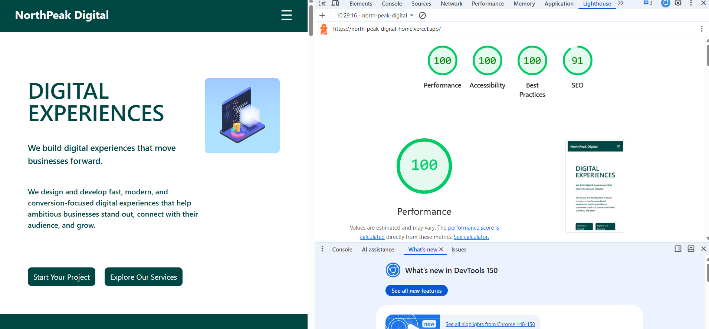
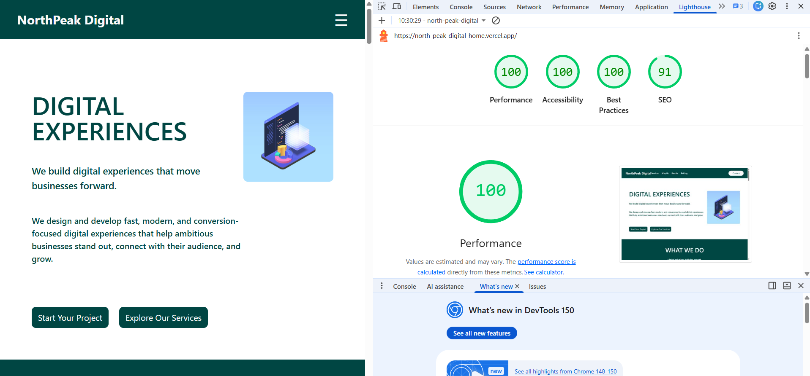

# NorthPeak Digital

## Task B — Optimization Changelog

### Overview

After completing and deploying the NorthPeak Digital website, I ran Lighthouse audits on the production Vercel deployment for both mobile and desktop.

The initial Lighthouse audit achieved a **Performance score of 100** and an **Accessibility score of 98**. I reviewed the accessibility audit to identify the cause of the missing points rather than making unnecessary changes solely to increase the score.

The audit identified that the page was missing a primary `<main>` landmark.

---

## 1. Added a Semantic `<main>` Landmark

### Issue

Lighthouse reported:

> "One main landmark helps screen reader users navigate a web page."

The primary page content did not have a semantic `<main>` landmark.

### Change

I updated the page structure in `Home.jsx` by wrapping the primary content sections inside a semantic `<main>` element.

The resulting structure is:

```text
Navbar
  ↓
<main>
  ├── Hero Section
  ├── Services Section
  ├── Why NorthPeak Section
  ├── Results Section
  ├── Pricing Section
  └── Contact Section
</main>
  ↓
Footer
```

The navigation and footer remain outside the `<main>` landmark because they represent separate page landmarks.

### Why

The `<main>` element provides a clear semantic landmark that identifies the primary content of the page. This allows screen reader users to more easily understand the page structure and navigate directly to the main content.

### Impact

This change improved the semantic structure and accessibility of the page.

After redeploying the updated implementation to Vercel and running Lighthouse again, the Accessibility score improved from **98 to 100**.

---

## 2. Lighthouse Verification

After implementing the accessibility improvement, I ran Lighthouse again on the deployed production website for both mobile and desktop.

### Final Lighthouse Results

| Category       | Mobile | Desktop |
| -------------- | -----: | ------: |
| Performance    |    100 |     100 |
| Accessibility  |    100 |     100 |
| Best Practices |    100 |     100 |
| SEO            |     91 |      91 |

The task required a minimum Lighthouse score of **90+ for Performance and Accessibility**.

The final implementation achieved:

* **100 Performance** on mobile and desktop
* **100 Accessibility** on mobile and desktop

### Final Mobile Lighthouse Report



### Final Desktop Lighthouse Report



---

## 3. Optimization Process

The optimization process followed an audit-driven approach:

```text
Initial Lighthouse Audit
        ↓
Performance: 100
Accessibility: 98
        ↓
Identify Accessibility Issue
        ↓
Missing semantic <main> landmark
        ↓
Implement Fix
        ↓
Wrap primary page content in <main>
        ↓
Redeploy to Vercel
        ↓
Run Lighthouse Again
        ↓
Performance: 100
Accessibility: 100
```

Rather than making unnecessary changes to chase Lighthouse scores, I focused on addressing the specific accessibility issue identified by the audit and then verified the result on the deployed application.

The final website meets and exceeds the required **90+ Performance and Accessibility** targets.

---

## 4. Final Outcome

The final Lighthouse audit demonstrates that the deployed NorthPeak Digital website achieved:

* **100 Performance**
* **100 Accessibility**
* **100 Best Practices**
* **91 SEO**

for both mobile and desktop testing.

The primary optimization made for Task B was the addition of a semantic `<main>` landmark, which resolved the Lighthouse accessibility issue identified during the initial audit and improved the Accessibility score from **98 to 100**.

---

## AI Usage

AI tools were used during the development and review process to help understand concepts, review implementation decisions, troubleshoot issues, and interpret Lighthouse audit results. I used AI as a supporting tool rather than directly submitting generated work, and I reviewed and adapted the suggestions to fit my own implementation, design decisions, and project structure.
