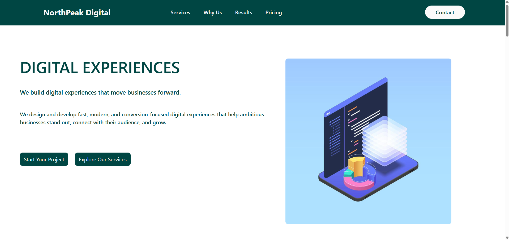
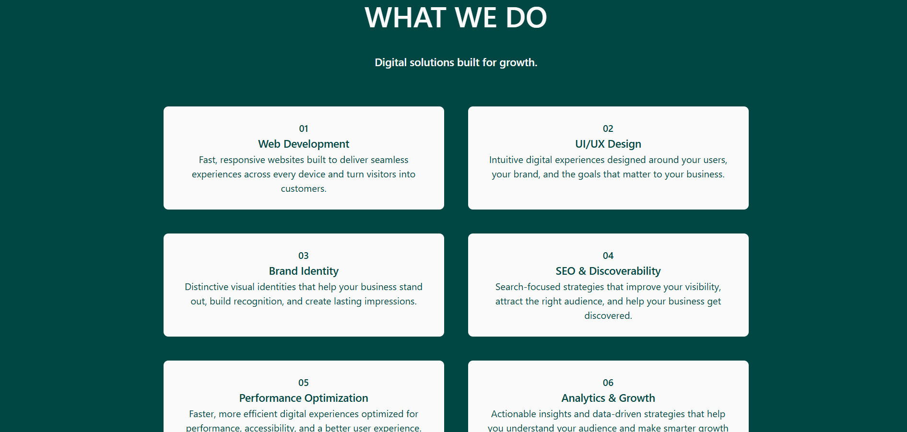
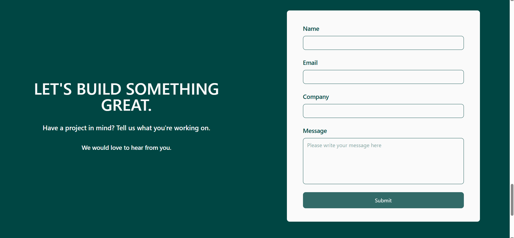

# NorthPeak Digital

> A modern, responsive digital agency website designed to showcase creative services, measurable results, client testimonials, and flexible pricing solutions.

**NorthPeak Digital** is a fictional digital agency landing page built as a frontend development project. The website is designed to present a professional agency experience with a strong visual hierarchy, clear service offerings, social proof, pricing plans, and a contact experience.

## 🚀 Live Demo

🌐 **Live Website:** https://north-peak-digital-home.vercel.app/

💻 **GitHub Repository:** https://github.com/chinmay21/NorthPeak-Digital

---

## ✨ Features

* Modern and professional digital agency landing page
* Fully responsive design for desktop, tablet, and mobile devices
* Hero section with clear calls-to-action
* Services section showcasing agency capabilities
* Results section highlighting business outcomes
* Client testimonials for social proof
* Three-tier pricing section
* Contact form for potential clients
* Responsive navigation
* Smooth section-based browsing
* Clean and reusable React component structure
* ESLint configuration for maintaining code quality

---

## 🛠️ Tech Stack

* **React.js** — Component-based UI development
* **Vite** — Fast development server and build tooling
* **JavaScript (ES6+)** — Application logic
* **CSS** — Styling and responsive layouts
* **ESLint** — Code quality and linting
* **Git & GitHub** — Version control and source code management
* **Vercel** — Deployment and hosting

---

## 📱 Responsive Design

The website is designed to provide a consistent user experience across different screen sizes:

* 📱 Mobile
* 📲 Tablet
* 💻 Desktop

The layout adapts to different viewport sizes to maintain usability, readability, and visual consistency across devices.

---

## 📂 Project Structure

```text
NorthPeak-Digital/
├── public/
├── src/
│   ├── assets/
│   ├── components/
│   ├── App.jsx
│   ├── main.jsx
│   └── ...
├── .gitignore
├── eslint.config.js
├── index.html
├── package-lock.json
├── package.json
└── vite.config.js
```

> The exact structure may evolve as the project is developed and components are refactored.

---

## ⚙️ Getting Started

### Prerequisites

Make sure you have the following installed:

* [Node.js](https://nodejs.org/)
* npm

Verify your installation:

```bash
node -v
npm -v
```

### Installation

Clone the repository:

```bash
git clone https://github.com/chinmay21/NorthPeak-Digital.git
```

Navigate to the project directory:

```bash
cd NorthPeak-Digital
```

Install the dependencies:

```bash
npm install
```

Start the development server:

```bash
npm run dev
```

Open the local development URL shown in your terminal, typically:

```text
http://localhost:5173
```

---

## 📦 Available Scripts

### Start Development Server

```bash
npm run dev
```

Runs the application in development mode using Vite.

### Build for Production

```bash
npm run build
```

Creates an optimized production build.

### Preview Production Build

```bash
npm run preview
```

Serves the production build locally for preview.

### Run ESLint

```bash
npm run lint
```

Checks the project for linting and code-quality issues.

---

## 🎯 Project Goals

The primary goals of this project were to:

1. Create a professional digital agency website.
2. Build a visually engaging and responsive user interface.
3. Present services and pricing in a clear and easy-to-understand format.
4. Establish credibility through results and testimonials.
5. Provide clear conversion paths through calls-to-action.
6. Ensure a consistent experience across mobile, tablet, and desktop devices.
7. Practice building a production-style React frontend using Vite.

---

## 🧠 Key Learning Outcomes

Through this project, I practiced:

* Building reusable React components
* Structuring a multi-section landing page
* Creating responsive layouts
* Designing conversion-focused user interfaces
* Implementing responsive navigation
* Creating service, testimonial, and pricing sections
* Handling form interactions
* Improving accessibility and frontend usability
* Using Git and GitHub for version control
* Deploying a frontend application with Vercel

---

## 📸 Screenshots

Add screenshots of the project here to showcase the website.

### Hero Section



### Services Section



### Contact Section



---

## 🚀 Deployment

The application is deployed and hosted on Vercel.

🌐 **Production Website:**

https://north-peak-digital-home.vercel.app/

---

## 🔮 Future Improvements

Potential future improvements include:

* Adding a backend-powered contact form
* Connecting the contact form to an email service
* Adding animations and micro-interactions
* Adding a dedicated case studies section
* Adding a blog or resources section
* Adding a CMS for managing website content
* Improving SEO metadata and structured data
* Adding automated testing
* Further optimizing Core Web Vitals

---

## 🤖 AI Usage

AI tools were used as a development assistant during the project for tasks such as brainstorming, debugging, reviewing implementation approaches, and improving development efficiency.

The project implementation, design decisions, structure, and final integration were reviewed by the developer. AI-generated suggestions were evaluated and adapted where appropriate rather than being used as a substitute for understanding or ownership of the code.

---

## 👨‍💻 Author

**Chinmay Dhaundiyal**

* GitHub: https://github.com/chinmay21
* Portfolio: https://chinmaydhaundiyal.vercel.app/

---

## 📄 License

This project is created for educational and portfolio purposes.

All branding and business information related to **NorthPeak Digital** is fictional and created for the purpose of this project.

---

⭐ If you found this project interesting, consider checking out the repository and exploring the implementation.
